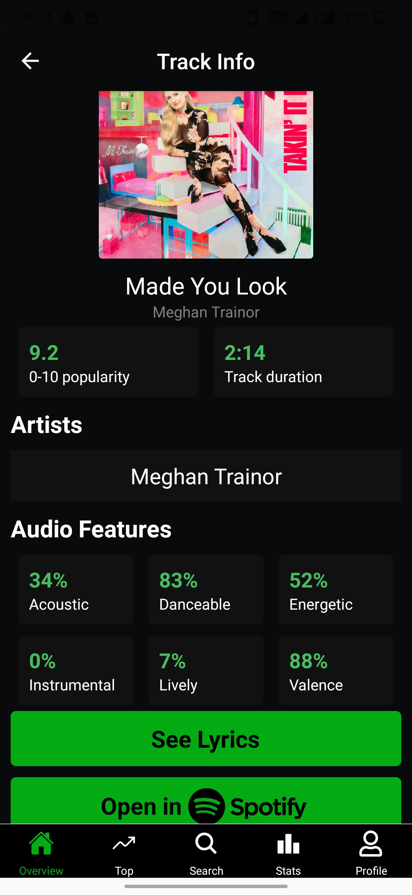

# Introduction

Link to download APK: https://drive.google.com/file/d/1QjerTFILLw9eZj-jCwSEMQoAemT0zXSq/view?usp=sharing

Spotify API provides a lot of valuable insights about a user’s music streaming habits which can help users to explore more about their music taste as well as provide interesting information about their favorite artists, genres, tracks, etc. But, these insights are not explicitly shown to the user while only a few are available once a year in Spotify Wrapped

This project aims to fetch this information from Spotify API as well as other API’s like the Genius API and build a mobile application to display these insights in an efficient and insightful manner.

#Task:
Build a mobile application that uses API’s like Spotify and Genius API to fetch data regarding users’ music activities and display them to the user.
The core functionalities are:
1. User authentication using Spotify API.
2. User statistics like favorite tracks, artists, genres, audio insights for various time durations like last 4 weeks, last 6 months, and lifetime statistics.
3. Album and track specific statistics like popularity, genres performed by an artist, audio features of tracks, lyrics, etc. along with a search feature to see the stats of any particular album, artist or track.

Tech Stack:
1. React Native: The framework used to build our mobile application.
2. Redux: To act as a store for our application and store various data which can be accessed throughout the application.
3. Spotify and Genius API (REST API’s): We use Axios to fetch the required data from these API’s.

The application opens up the login page when it first starts. The user is prompted to login using his/her spotify account credentials. 

The app uses React Navigation tools like Stack navigation, and Tab Navigation to navigate between screens.
The app checks if the user is signed in and accordingly shows either the login Navigation Stack or the Home Navigation Stack.
The Home page is displayed once the user is logged into the app. This page shows user’s recently played songs and has a button which navigates to the Global top 50 songs page. The top 50 tracks on Spotify are displayed on this page. User can tap on any track/artist to navigate to the tracks/artist page which shows track/artist specific stats like popularity, audio insights, lyrics for tracks and genres and popularity for artists.

The lyrics are fetched from the Genius API as Spotify API does not have an endpoint for this. Further, Home page has a navigation bar at the bottom through which users can navigate to the following pages from the home page:
1. Your Top Streams: Shows users top 50 artists and tracks for the past 4 weeks, 6 months and lifetime. The duration can be toggled as desired. Again, users can tap on an artist or track to see specific insights.

2. Search Page: Users can search for any tracks or artists and see specific insights for them through this page.

3. Your Stats page: All the major stats like Users top genres, top 3 favourite artists and tracks, as well as audio insights for users top streams are displayed here. Users can share these insights by taking a screenshot of this page.

4. Profile page: This page shows users’ profile info like country, email, followers, etc. and has a Logout button to logout from the app.

